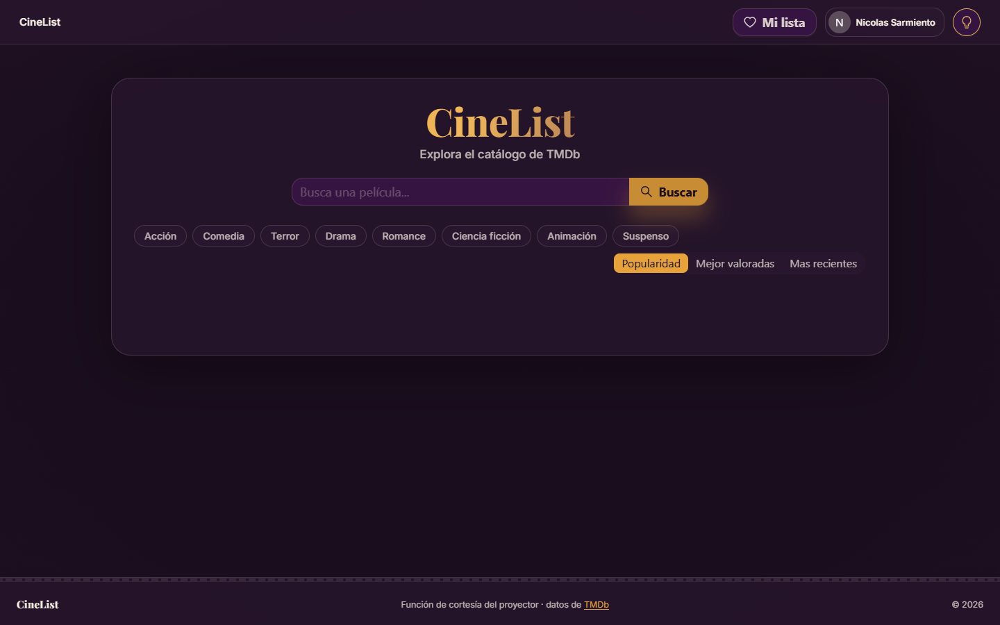
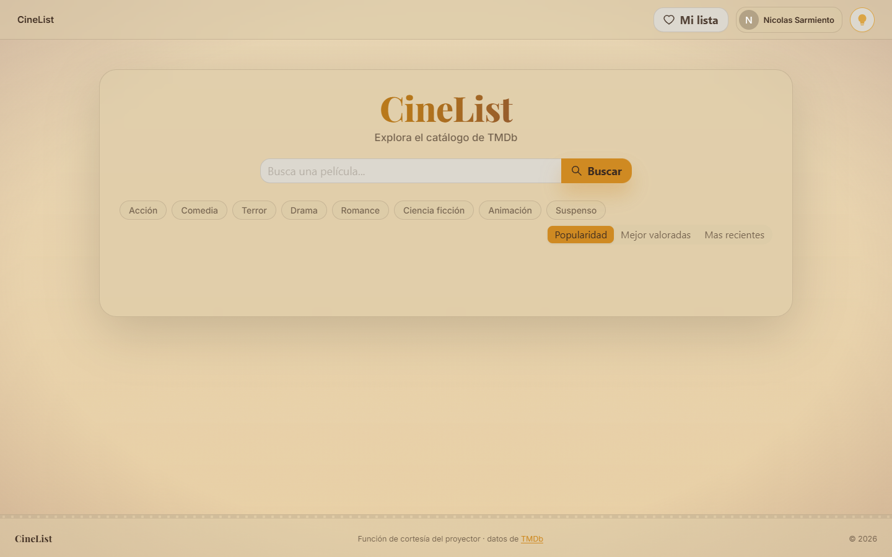
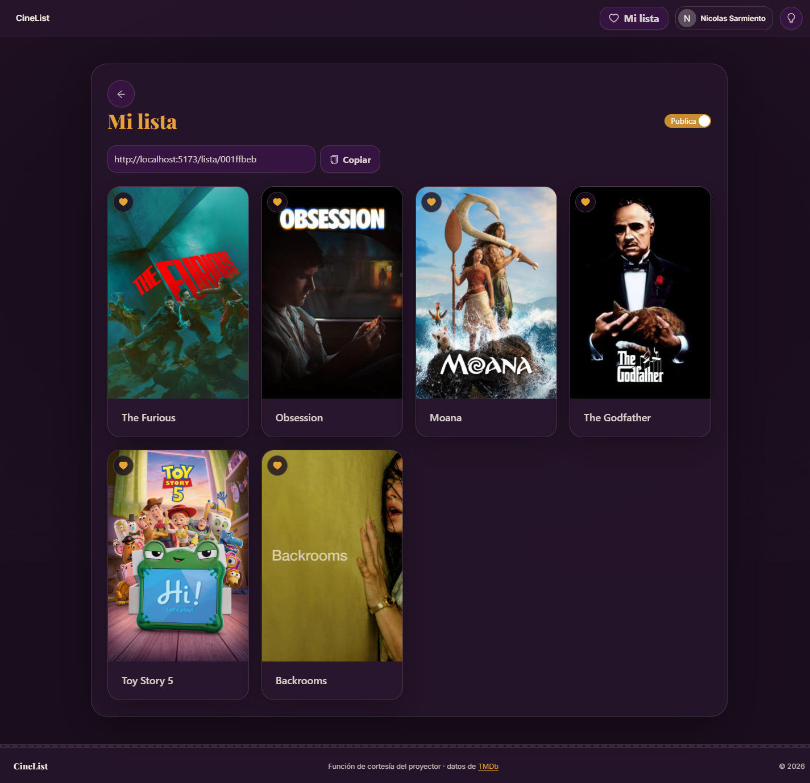

# Marquesina

### Buscador de Peliculas


Aplicacion web para descubrir y buscar peliculas usando la API de TMDb (The
Movie Database). Permite explorar tendencias y catalogo por genero, guardar
favoritos, armar una lista personal y compartirla publicamente, todo con
autenticacion via Google y una interfaz clara/oscura con identidad visual
propia ("Marquesina").

Demo: [agregar URL de demo]





> **Nota sobre capturas**: las capturas en `docs/screenshots/` (`home-dark.png`,
> `home-light.png`, `mi-lista.png`) son del entorno LOCAL de desarrollo
> (`npm run dev`), no de produccion. La unica URL de convencion probada
> (`https://buscador-peliculas-react.vercel.app`) responde, pero sirve una
> UI generica que no corresponde a este codigo base (sin la paleta
> Marquesina, sin Header/Footer/FilmIntro), probablemente un deployment
> viejo o distinto con el mismo nombre de proyecto en Vercel; por eso no se
> pudo confirmar la URL real vigente. Ademas, `vite` en local no ejecuta las
> funciones serverless de `api/` (requieren `vercel dev`, que en esta maquina
> falla por un conflicto entre el rewrite catch-all de `vercel.json` y el
> middleware de import-analysis de Vite), asi que los carruseles de
> tendencias/genero salen vacios en las capturas de home. `detalle-modal.png`
> quedo pendiente por el mismo motivo (sin datos de TMDb no hay tarjetas para
> abrir). `lista-publica.png` tambien quedo pendiente: aunque se encontro un
> `shareSlug` real de una lista existente en Firestore, la vista publica
> respondio "Esta lista no esta disponible" en el entorno local. Actualizar
> esta seccion con capturas reales una vez confirmada la URL de produccion
> vigente.

## Caracteristicas

- **Home**: peliculas en tendencia, carruseles por categoria (top valoradas,
  proximos estrenos, etc.) y chips de genero con seleccion multiple + orden
  por popularidad, valoracion o fecha.
- **Busqueda** de peliculas por titulo.
- **Favoritos** por pelicula (icono de corazon) y **detalle** en modal
  (sinopsis, reparto, videos, recomendaciones).
- **Login con Google** via Firebase Auth (`signInWithRedirect`, sin popup).
- **Lista personal** (`/mi-lista`, requiere sesion) guardable y **compartible
  publicamente** en `/lista/:shareSlug`, con recomendaciones basadas en la
  primera pelicula de la lista. La lectura publica no requiere login.


- **Tema claro/oscuro** persistido en `localStorage`.
- Interfaz responsiva construida con Ant Design 6.

## Seguridad

El cliente **nunca** llama directo a la API de TMDb ni conoce el token: todas
las peticiones pasan por `src/services/movieApi.ts` hacia funciones
serverless propias (`/api/search`, `/api/movies`), que:

- Leen `TMDB_API_TOKEN` solo del lado del servidor (`process.env`), nunca
  expuesto al bundle del cliente.
- Validan los parametros de entrada (`query` no vacio y <=200 caracteres,
  `page` entero entre 1 y 1000, `sort_by` contra una whitelist, etc.) antes
  de reenviar la peticion a TMDb.
- Devuelven codigos de error explicitos: `400` por parametros invalidos,
  `500` si falta el token, `502` si falla la peticion a TMDb.

Las reglas de Firestore (`firestore.rules`) restringen cada lista a su
dueño (lectura/escritura), impiden el borrado del documento y permiten
lectura publica solo si `isPublic == true`.

## Stack

- React 19 + TypeScript 6 + Vite 7 (`@vitejs/plugin-react-swc`)
- Ant Design 6 (UI)
- React Router 7
- Firebase 12 (Auth + Firestore)
- Funciones serverless en `api/` (Vercel, runtime Node)
- ESLint 9 + Prettier 3

## Arquitectura

`src/main.tsx` define la jerarquia de la app:

```
ThemeProvider
  AuthProvider
    FilmIntro (overlay, una vez por sesion)
    BrowserRouter
      Header (fijo)
      Routes
        "/"                 -> MovieSearch (home + busqueda)
        "/mi-lista"         -> MyList (requiere sesion)
        "/lista/:shareSlug" -> PublicList (lectura publica sin login)
      Footer
```

Las llamadas a red del cliente van siempre por `src/services/movieApi.ts`
hacia `/api/search` y `/api/movies` (proxy TMDb) o `src/services/firebase.ts`
(Auth y Firestore). Los tipos de dominio viven en `src/types/movies.ts`.

### Firestore

Una lista por usuario en `lists/{listId}` (donde `listId` es el `uid` del
dueño), con campos `ownerId`, `title`, `isPublic`, `shareSlug` (generado con
`crypto.randomUUID().slice(0, 8)`) y `createdAt`. Las peliculas de la lista
viven en la subcoleccion `lists/{listId}/items/{itemId}`.

## Instalacion y uso local

```bash
git clone <url-del-repo>
cd buscador-peliculas-react
npm install
```

Copiar `.env.example` a `.env.local` y completar las variables (ver tabla
abajo).

```bash
npm run dev
```

Levanta la app en `http://localhost:5173`.

> **Importante**: `npm run dev` solo levanta Vite (el frontend). Las
> funciones serverless de `api/` (`/api/search`, `/api/movies`) **no**
> corren con ese comando. Para probarlas localmente hace falta la Vercel
> CLI:
>
> ```bash
> npx vercel dev
> ```

### Variables de entorno

| Variable | Uso |
|---|---|
| `TMDB_API_TOKEN` | Token de TMDb, solo servidor (usado por `api/`). **Nunca** con prefijo `VITE_`. |
| `VITE_FIREBASE_API_KEY` | Config publica de Firebase (cliente). |
| `VITE_FIREBASE_AUTH_DOMAIN` | Config publica de Firebase (cliente). |
| `VITE_FIREBASE_PROJECT_ID` | Config publica de Firebase (cliente). |
| `VITE_FIREBASE_STORAGE_BUCKET` | Config publica de Firebase (cliente). |
| `VITE_FIREBASE_MESSAGING_SENDER_ID` | Config publica de Firebase (cliente). |
| `VITE_FIREBASE_APP_ID` | Config publica de Firebase (cliente). |

## Scripts disponibles

| Script | Comando | Descripcion |
|---|---|---|
| `npm run dev` | `vite` | Servidor de desarrollo (solo frontend). |
| `npm run build` | `tsc -b && vite build` | Chequeo de tipos + build de produccion. |
| `npm run lint` | `eslint .` | Linteo del proyecto. |
| `npm run preview` | `vite preview` | Sirve el build de produccion localmente. |
| `npm run format` | `prettier --write "src/**/*.{ts,tsx,js,jsx,css}"` | Formatea `src/` con Prettier. |
| `npm run format:check` | `prettier --check "src/**/*.{ts,tsx,js,jsx,css}"` | Verifica formato sin escribir. |

## Estructura de carpetas

```
src/
  assets/            react.svg, no-poster.svg, img/fondo.jpg
  components/
    AuthButton/
    Footer/
    FilmIntro/
    GenreChips/
    Header/
    MovieCard/         MovieCard, MovieDetail, FavoriteButton
    MovieCarousel/
    MovieSearch/        MovieSearch, MovieRows
    MyList/
    PublicList/
  constants/genres.ts
  contexts/            ThemeContext, AuthContext
  hooks/               useTheme, useAuth, useMyList, useFirstListMovieId
  providers/           ThemeProvider, AuthProvider
  services/            movieApi.ts, firebase.ts
  styles/global.css
  theme/antdTheme.ts
  types/movies.ts
  main.tsx
api/
  search.ts
  movies.ts
firestore.rules
```

## Subagentes de Claude Code

Este repo incluye configuraciones de subagentes (`.claude/agents/`) para
trabajar con Claude Code: `ux-color-designer` (diseno y paletas),
`frontend-implementer` (features y componentes), `security-auditor`
(auditoria de seguridad), `qa-build-reviewer` (verificacion de build/lint/
accesibilidad) y `orchestrator` (coordina a los demas).

## Troubleshooting

- **Puerto ocupado**: si `5173` esta en uso, Vite ofrece automaticamente el
  siguiente puerto libre.
- **Falta `TMDB_API_TOKEN`**: `/api/search` y `/api/movies` responden `500`.
  Verificar que la variable este en `.env.local` (o en el entorno de
  Vercel) sin prefijo `VITE_`.
- **`/api/*` no responde en desarrollo**: `npm run dev` solo sirve el
  frontend con Vite. Usar `npx vercel dev` para levantar tambien las
  funciones serverless.
- **El login con Google no completa el redirect**: `signInWithRedirect`
  requiere que el dominio este en la lista de *Authorized domains* de
  Firebase Authentication, y que Firebase Hosting este inicializado en el
  proyecto de Firebase para que el flujo de redirect complete
  correctamente. Sin esto, `getRedirectResult` en `AuthProvider` no
  resuelve la sesion al volver del redirect.

## Licencia

[agregar LICENSE]

## Autor

- Nombre: [TU NOMBRE]
- Contacto: [tu-email@ejemplo.com]
- GitHub: [link]
- LinkedIn: [link]
